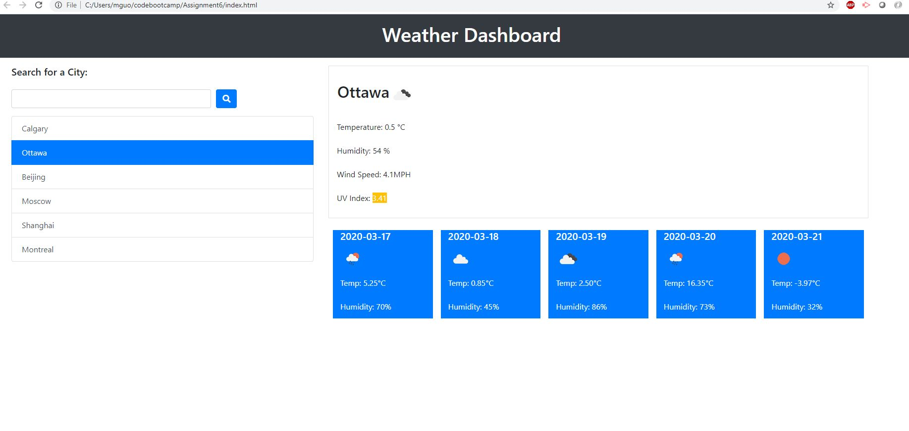
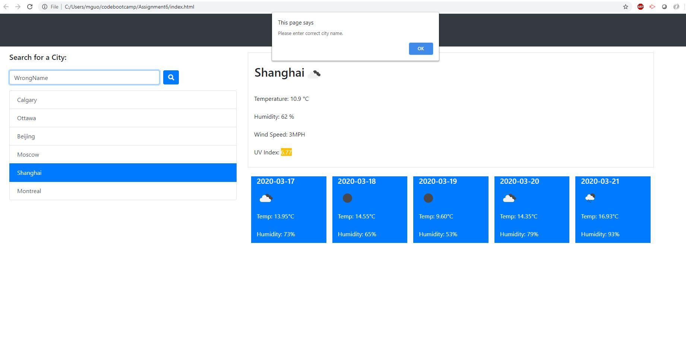

# Assignment 6  Weather Dashboard

A simple Weather Dashboard that allows the user to retrive weather data for multiple cities.  
```
```
Project URL: https://maxguojiaqi.github.io/Assignment6/

```
After open the dashboard. User will be able to input city name and retrive current and 5 days future weather information.
```
```
The current weather information contains:
City name, the date, an icon representation of weather conditions, the temperature, the humidity, the wind speed, and the UV index
```
```
The 5 days future weather infromation contains: 
The date, an icon representation of weather conditions, the temperature, and the humidity
```
```
All the search history will be stored. 
When click on the city name in the search histroy, current and 5 days future weather information for that city will be displayed again.

All the information will be stroed within the browser, current state will be preverserd even after refeash the browser.
```
Below is a screenshot of the working app

```
If city name is invalid, user will be alert with error. 
```
Below is a screenshot when user enter the wrong name.




This app runs in the browser and features dynamically updated HTML and CSS powered by Bootstrap.
For more information about Bootstrap, visit: https://getbootstrap.com/
This app uses a third party API from OpenWeatherMap, for details about open weather map, visit https://openweathermap.org/

